# AFDD behavior

## Rule model

Every rule stores target scope separately from fault logic. Target fields select property type, buildings, served floors, served zones or rooms, equipment type and explicit exclusions. Logic fields select operating state, left and right point classes, comparison operator, threshold, unit, duration, freshness, severity and recovery policy. Property overrides can replace threshold or duration without copying the rule.

The required rule is configuration: office AHUs serving tenant areas, while ON, with an absolute supply-air temperature versus setpoint difference greater than 3°C for 15 continuous minutes. Inputs must be `GOOD` and no older than 120 seconds. Building-specific threshold or duration overrides are resolved during preview and preserved in issue evidence.

## Target resolution

The registry follows explicit ontology relationships. For each candidate AHU it resolves the served zone, parent floor, parent building and contained rooms. It validates property and space use, selectors, exclusions, exactly one required point of each class and compatible comparison units.

Preview returns matched equipment, relationship paths, global logic, effective local logic, affected spaces and exclusions. Activation recomputes preview inside the transaction and compares its digest with the reviewed digest. A graph or configuration change therefore invalidates stale approval.

## Event-time state machine

```mermaid
stateDiagram-v2
    [*] --> NORMAL
    NORMAL --> QUALIFYING: ON + fresh GOOD inputs + comparison true
    QUALIFYING --> QUALIFYING: condition remains true and interval is continuous
    QUALIFYING --> ACTIVE: elapsed event time reaches duration
    QUALIFYING --> NORMAL: OFF or comparison false
    QUALIFYING --> INSUFFICIENT_DATA: missing, bad, future or stale input
    INSUFFICIENT_DATA --> QUALIFYING: complete trusted inputs return and condition is true
    INSUFFICIENT_DATA --> NORMAL: complete trusted inputs return and condition is false or OFF
    ACTIVE --> RECOVERED: comparison normal or AHU OFF
    ACTIVE --> INSUFFICIENT_DATA: evidence is incomplete; issue remains open
    RECOVERED --> QUALIFYING: later independent recurrence begins
```

The first qualifying observation starts the interval. A strict `>` comparison means exactly 3°C does not qualify. With one-minute observations and a 15-minute duration, the trigger is the observation 15 minutes after the first qualifying sample; evidence contains the complete 16-sample interval.

## Edge cases

| Condition | Behavior |
|---|---|
| AHU turns OFF before trigger | Reset the qualifying interval; create no issue |
| AHU turns OFF while active | Recover the issue with reason `OFF` |
| Difference returns to normal | Reset a qualifying interval or recover the active issue with reason `NORMAL` |
| Blank source measurement | Store a null `MISSING` observation; it cannot qualify |
| Bad or uncertain quality | Mark evaluation insufficient; it cannot qualify |
| Required point absent from ontology | Exclude equipment visibly during preview |
| Input older than freshness | Mark evaluation insufficient and reset qualification |
| Gap longer than freshness | Reset the continuous interval before evaluating the next frame |
| Late observation older than evaluated state | Retain it in history but do not rewrite state or issue evidence |
| Duplicate event ID and same payload | Record duplicate audit; no second business effect |
| Reused event ID with changed payload | Reject visibly |
| Later recurrence | Open a new issue record after a new full qualifying interval |
| Rule adjustment | Create an immutable draft version; existing evidence keeps its opening version |
| New version activation | Disable the former active version, stop its active issues and clear its states |

Missing data does not prove recovery. If an issue is already active, insufficient data changes evaluation state but leaves the issue open until trusted data demonstrates normal operation or OFF state.

## Evidence model

An issue stores rule ID and version, full opening configuration, effective override, threshold, severity, trigger interval, device-time observations, calculated difference, data quality, graph paths, affected zone and rooms, platform creation time and eventual recovery evidence. The dashboard labels affected rooms as potentially affected and keeps installation location separate.

## Scheduling and concurrency

Ingestion appends one durable outbox item in the same transaction as telemetry history and current-state updates. The evaluator reads at most 5,000 pending items per transaction, groups them by device timestamp and waits two seconds in live mode to collect a frame. It batch-loads the latest required observations and processes timestamps in order.

PostgreSQL allows one evaluator drain through an advisory try-lock. Rule changes and event receipts use scoped advisory locks. SQLite tests use immediate write transactions. This design favors deterministic state transitions; horizontal evaluation scaling requires partition ownership by site or rule family.
