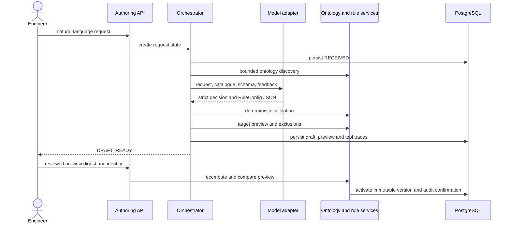
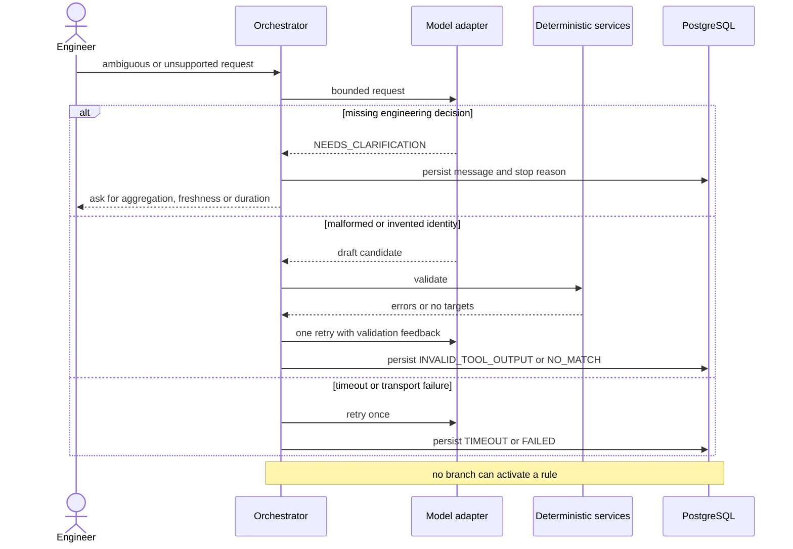

# AI rule-authoring design

## Boundary and operating modes

The authoring workflow turns natural language into a reviewable draft. It cannot activate rules. The repository includes a deterministic exact-example provider for offline demonstration and a server-side OpenAI Responses API adapter for a reviewer-provided `OPENAI_API_KEY` and `OPENAI_MODEL`.

No real-model evaluation is bundled because credentials and model choice belong to the reviewer environment. The same orchestrator, validation, preview, persistence and human gate are used in both modes; deterministic tests inject provider responses at the model boundary.

## Successful request

## Clarification and failure path

## Bounded tool contracts

| Tool | Input | Output | Bound |
|---|---|---|---|
| `discover_ontology` | server-held registry | IDs, labels, kinds and metadata | maximum 1,000 catalogue entities |
| `interpret_request` | prompt, catalogue, prior feedback | strict `Decision` JSON schema | two attempts, 25-second HTTP timeout |
| `validate_rule` | `RuleConfig` | valid flag and deterministic errors | no model authority |
| `preview_rule_target` | validated configuration | matches, paths, effective values, digest | server-resolved identities only |
| `get_exclusions` | preview result | exclusion reasons and missing points | read-only |

The model cannot execute code, provide SQL, access arbitrary endpoints or select identities outside the supplied catalogue. `extra="forbid"`, finite numeric bounds and literal enums reject unexpected fields and unsafe operators.

## Request states

`RECEIVED → DISCOVERING → PLANNING → VALIDATING → PREVIEWING → DRAFT_READY`

Safe terminal or waiting states are `NEEDS_CLARIFICATION`, `UNSUPPORTED`, `NO_MATCH`, `INVALID_TOOL_OUTPUT`, `TIMEOUT`, `FAILED` and `STOPPED`. Activation is a separate human action and records the confirmation, preview digest and resulting version.

## Persistence and observability

Each request stores schema version, configured model name, input, state, draft, reviewed configuration, preview, latency, stop reason and tool traces. Each trace includes a run ID, attempt number, result and elapsed time. Rule creation and activation also enter the shared audit log.

The configured API key remains in the API container environment and is never persisted or returned. The adapter sends `store: false` and requests strict structured output.

## Evaluation matrix for the integrating team

Before enabling model mode in a deployment, run the supplied supported, paraphrased, ambiguous, unsupported, no-match, invented-asset, changed-ontology and recoverable-failure cases against the selected model version. Record structure accuracy, target accuracy, clarification correctness, safe rejection, latency, retry rate and zero activation without confirmation. Deterministic tests remain the regression baseline.

## Evolution

At higher request volume, enqueue authoring requests and make the API return a request ID immediately. Cache ontology catalogues by tenant and ontology revision, store prompt/schema/model versions, run compatibility evaluations before upgrades and apply rate limits and cost budgets per tenant. A proposal can graduate only after deterministic validation, preview and explicit human confirmation.
