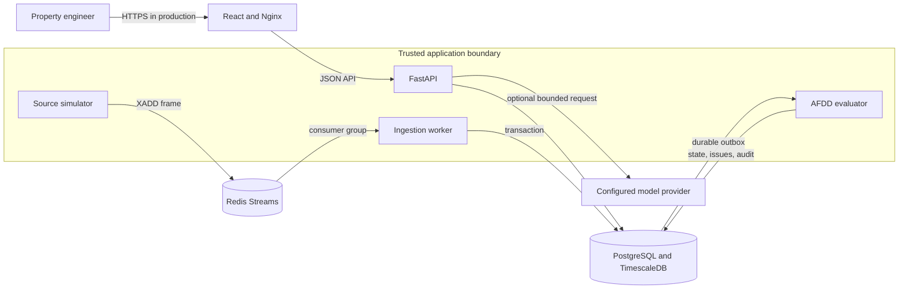

# System architecture

## Product boundary

The platform accepts telemetry and engineering intent. It does not control equipment or assert a mechanical root cause. Device time is domain time; receipt time is operational metadata. Human confirmation is the only route from a draft rule to active monitoring.



The browser is untrusted. Rule validation, ontology resolution, preview digest verification and activation happen on the server. The optional model provider receives a bounded ontology catalogue and a strict output schema; it cannot execute code, query arbitrary data or activate a rule.

## Telemetry flow

```mermaid
sequenceDiagram
    participant S as Simulator
    participant R as Redis Stream
    participant I as Ingestion worker
    participant D as PostgreSQL/TimescaleDB
    participant E as AFDD evaluator

    S->>R: XADD frame with event IDs and device times
    R->>I: consumer-group delivery
    I->>D: begin transaction
    I->>D: validate ontology identity, type, time, unit, quality
    I->>D: insert receipt and telemetry, conditionally update current value
    I->>D: append durable evaluation outbox item; audit exceptional input
    I->>D: commit
    I->>R: acknowledge only after commit
    E->>D: acquire evaluator try-lock and read bounded outbox batch
    E->>D: batch latest trusted inputs by event time
    E->>D: update state, issue evidence and outbox atomically
```

Redis provides transport and redelivery. PostgreSQL receipts provide business idempotency. A duplicate delivery is acknowledged after the existing receipt is verified and has no second telemetry or evaluation effect. An acknowledgement failure causes safe redelivery.

## AFDD flow

An active rule is immutable. The evaluator resolves its target scope from the ontology, calculates effective property overrides, and evaluates only equipment affected by changed points. A PostgreSQL advisory try-lock gives one active evaluator drain while allowing API and ingestion transactions to proceed concurrently. Each drain is capped at 5,000 outbox items and fetches the latest required point values in one window query per device timestamp.

Issues preserve the opening version, effective logic, trigger interval, observations, differences, quality and affected-space path. Adjusting a rule creates a new draft version. Activating it stops the superseded version without rewriting historical evidence.

## Service and data boundaries

| Boundary | Responsibility | Failure behavior |
|---|---|---|
| Nginx/React | Navigation, visualization and review workflow | API and WebGL failures have visible fallback states |
| FastAPI | Contracts, application services and human gate | Refuses startup when the database is not at migration head |
| Redis Streams | At-least-once telemetry delivery | Pending messages are reclaimed after consumer failure |
| Ingestion worker | Validation, idempotency, history/current writes | Commits before acknowledgement; rejects are audited |
| PostgreSQL | Inventory, relationships, rules, issues, requests and audit | Alembic owns schema changes |
| TimescaleDB hypertable | Telemetry history | Composite point/time index supports latest and history queries |
| AFDD worker | Deterministic event-time evaluation | Singleton drain avoids duplicate state transitions |
| Optional model provider | Structured draft interpretation | Bounded retries; failure cannot activate a rule |

## Persistence model

Application and time-series data share the TimescaleDB PostgreSQL foundation to keep ingestion, outbox publication and current-value updates in one transaction. Telemetry is a hypertable keyed by device timestamp and event ID. Current values are a separate projection updated only by newer observations. The evaluation outbox is durable and indexed by pending status and sequence ID.

Ontology entities and directed relationships are relational. The registry builds in-memory adjacency indexes for traversal during a transaction. A versioned semantic layer maps internal stable tokens to Brick and QUDT URIs without duplicating derived URIs in every database row.

## Deployment and trust boundaries

Docker Compose is the reproducible local and review deployment. Ports bind to loopback. Credentials enter backend containers through environment variables and are not embedded in frontend assets. Production deployment still requires TLS termination, identity, authorization, secret storage, network policy, backups and tenant isolation.

## Evolution path

For more sites, partition telemetry and evaluation ownership by site, cache ontology snapshots by revision, replace full dashboard polling with cursor-based changes or server events, and run model authoring as an asynchronous job. Timescale compression and retention should be configured only after operational retention requirements are agreed because issue evidence refers to historical observations.
