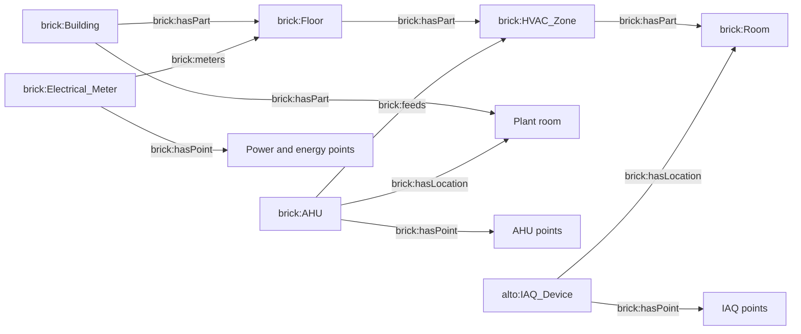

# Brickschema model

## Version and representation

The assessment pack asks for a pinned Brickschema version but does not contain a version value. The implementation therefore pins stable Brick `1.4.4` explicitly in `backend/app/semantic.py`. The operational graph remains relational for transactional simplicity; `/api/ontology`, entity responses and relationship responses expose the semantic mapping as full URIs.

The mapping follows the reference classes named in the assignment. Brick 1.4 marks location classes as deprecated in favor of RealEstateCore, but the assessment explicitly asks for `brick:Building`, `brick:Floor`, `brick:Room` and `brick:HVAC_Zone`; those are retained for assessment compatibility. A future ontology revision can map the same internal tokens to REC without rewriting telemetry identities.

## Entity mapping

| Internal kind | Semantic class |
|---|---|
| `Building` | `brick:Building` |
| `Floor` | `brick:Floor` |
| `Room` | `brick:Room` |
| `HVAC_Zone` | `brick:HVAC_Zone` |
| `AHU` | `brick:AHU` |
| `Electrical_Meter` | `brick:Electrical_Meter` |
| `IAQ_Device` | `alto:IAQ_Device` application class |
| `Run_Status` | `brick:Run_Status` |
| `Alarm` | `brick:Alarm` |
| `Supply_Air_Temperature_Sensor` | `brick:Supply_Air_Temperature_Sensor` |
| `Return_Air_Temperature_Sensor` | `brick:Return_Air_Temperature_Sensor` |
| `Supply_Air_Temperature_Setpoint` | `brick:Supply_Air_Temperature_Setpoint` |
| `Electrical_Power_Sensor` | `brick:Electrical_Power_Sensor` |
| `Electrical_Energy_Sensor` | `brick:Electrical_Energy_Sensor` |
| `Zone_Air_Temperature_Sensor` | `brick:Zone_Air_Temperature_Sensor` |
| `Humidity_Sensor` | `brick:Humidity_Sensor` |
| `CO2_Sensor` | `brick:CO2_Sensor` |

The assessment does not nominate a Brick equipment class for the combined IAQ device. It is kept as an application class while each owned measurement has an explicit Brick point class. This avoids falsely classifying a physical multi-sensor device as one of its telemetry points.

## Relationship mapping

| Internal relationship | Semantic relationship | Meaning |
|---|---|---|
| `hasPart` | `brick:hasPart` | Building/floor/zone composition |
| `hasPoint` | `brick:hasPoint` | Equipment owns a telemetry point |
| `hasLocation` | `brick:hasLocation` | Physical installation location |
| `feeds` | `brick:feeds` | AHU supplies its downstream HVAC zone |
| `measuresSpace` | `brick:meters` | Floor meter represents the supplied floor scope |

`hasLocation` and `feeds` are deliberately separate. An AHU is installed in a plant room but feeds an HVAC zone. Potentially affected rooms are reached through `AHU → feeds → HVAC_Zone → hasPart → Room`; the plant room never enters that affected path.



## Units and time-series identity

Point units map to QUDT URIs: degrees Celsius, percent, parts per million, kilowatts, kilowatt-hours and unitless binary state. Source units remain in provenance. Each canonical point ID is the join key across ontology ownership, current state, TimescaleDB history, rule matching and preserved issue evidence.

The source register is retained in each entity's application metadata. It is evidence for how the canonical entity was created, not an alternate graph that the evaluator interprets at runtime.

## Query behavior

The database stores entities and directed edges. Registry construction validates targets and builds outgoing and incoming adjacency indexes. Scope resolution follows explicit edges only; readable IDs are never parsed for building, floor or zone meaning.

The semantic manifest is available at:

```text
GET /api/ontology
```

Discovery responses include `semantic_type` and point responses include `semantic_unit`. Relationship responses include `semantic_relation`.

## Onboarding and ontology change

1. Validate source entity IDs, kinds, point ownership, units and relationship endpoints before import.
2. Add any new internal kind or relationship to the versioned semantic mapping and tests.
3. Import through the inventory service; silent mutation of an existing entity is rejected.
4. Preview every draft rule against the new graph.
5. Existing preview digests become stale when targets change, so activation requires another human review.
6. Roll out schema changes through Alembic when storage columns or indexes change.

A larger deployment should assign an ontology revision to each imported graph and cache adjacency snapshots by tenant and revision. Compatibility tests should run the active rule catalogue against the proposed revision before promotion.

References: [Brick relationships](https://docs.brickschema.org/brick/relationships.html), [Brick meters](https://docs.brickschema.org/modeling/meters.html), [Brick distributions](https://brickschema.org/resources/).
