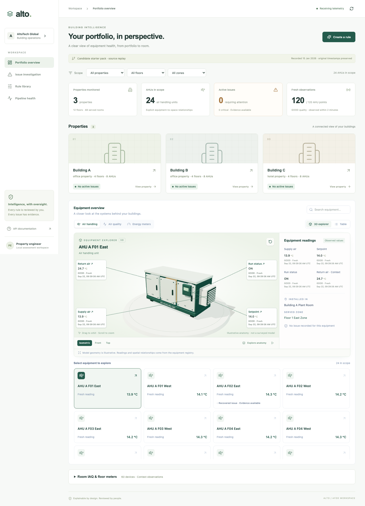
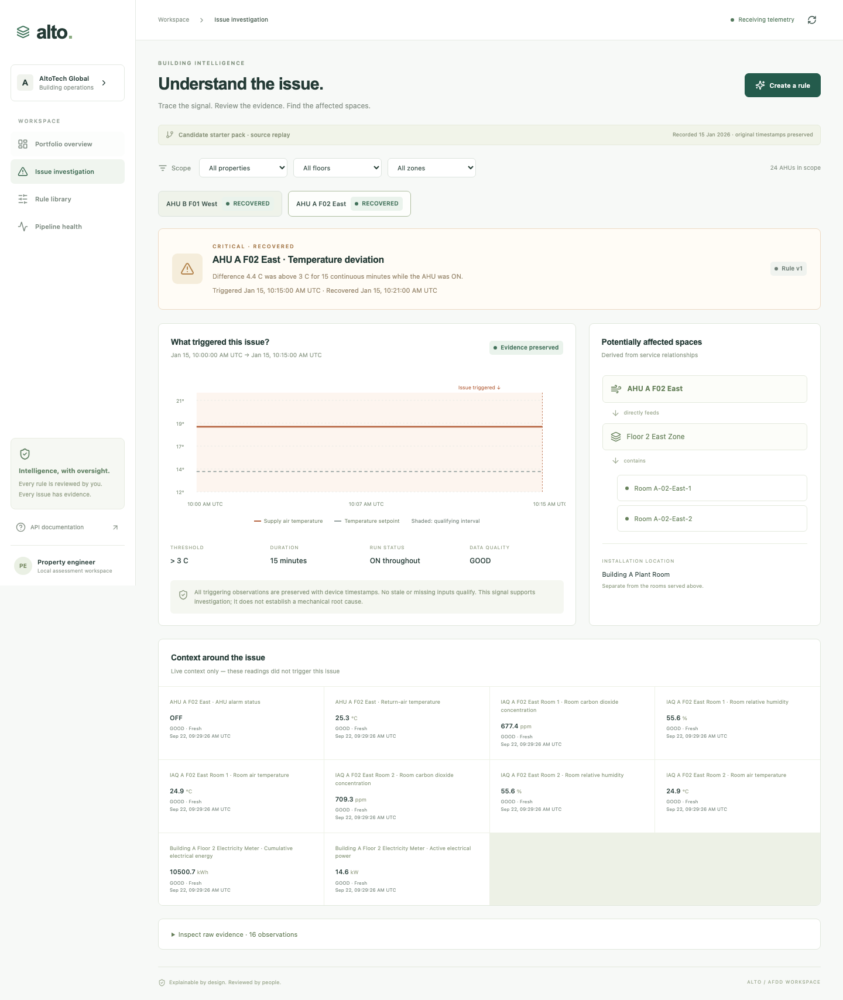
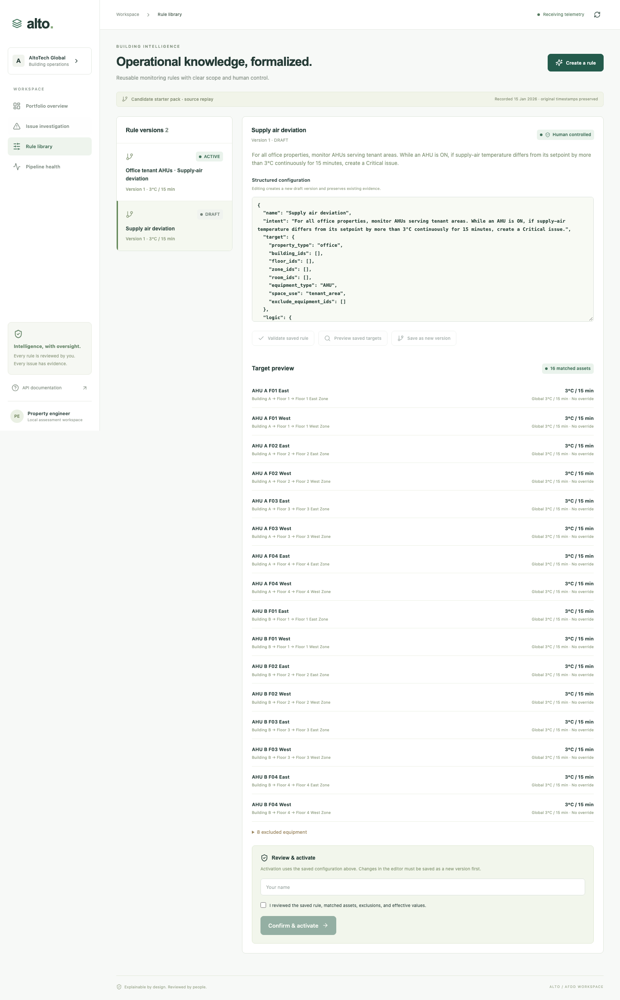
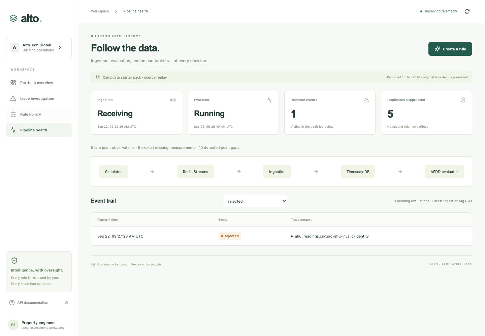

# Demonstration guide

## Start from a clean environment

```sh
cp .env.example .env
./scripts/demo.sh
```

Open <http://127.0.0.1:5173>. The deterministic pack demo imports 103,655 observations and creates the two expected recovered issues. For an ongoing live display, start `live-source-simulate` as described in the root README.

Regenerate the sequenced screenshots from the running stack with `npm run capture:demo --prefix frontend`. The capture reuses an existing draft, so repeated runs do not keep adding rule versions.

## Walkthrough

1. **Portfolio overview.** Select Building A and inspect AHUs, IAQ devices, and floor meters. The values, quality, freshness, and units come from the API and are also rendered on the selected 3D equipment model.

   

2. **Issue investigation.** Open `Issue investigation`, then `AHU A F02 East`. Confirm rule version 1, a 3 °C threshold, a 15-minute qualifying window ending at 10:15 UTC, recovery at 10:21 UTC, ON status, good-quality observations, and the served zone-to-room path. Evidence timestamps are displayed in UTC. The plant-room installation remains separate from the potentially affected rooms.

   

3. **Safe rule authoring.** Select `Create a rule`, generate the supported example, and review the structured draft. Inspect matched assets, relationship paths, missing-point exclusions, and Building B's local 2 °C override. Activation stays disabled until a named reviewer checks the confirmation box.

   

4. **Pipeline health.** Open `Pipeline health` and inspect simulator, Redis, ingestion, evaluator, rejection, duplicate, late-event, and lag signals. Use OpenAPI at <http://127.0.0.1:8000/docs> to trace the same inventory, telemetry, rules, issues, and health resources directly.

   

## Expected supplied outcomes

| Equipment | Effective threshold | Trigger | Recovery |
|---|---:|---|---|
| `ahu-a-f02-east` | 3 °C | 2026-01-15 10:15 UTC | 2026-01-15 10:21 UTC |
| `ahu-b-f01-west` | 2 °C local override | 2026-01-15 11:35 UTC | 2026-01-15 11:41 UTC |

Normal, short-deviation, OFF, missing, stale, invalid, and excluded-equipment cases create no misleading issue. Duplicate source events have no second business effect, and late observations remain in history without replacing the latest value.

## AI assistance note

OpenAI Codex was used to inspect the supplied material, implement and refactor the application, generate test scaffolding, and audit the final behavior. Every change was checked against deterministic tests and the supplied telemetry. One generated direction was corrected: continuously replaying the original event IDs would only produce duplicates and stale current values, so live simulation now issues new event IDs and current device timestamps while retaining the source IDs and timestamps as provenance. The deterministic replay remains separate for reproducible expected outcomes.

The repository contains a bounded AI rule-authoring harness and optional server-side model configuration. Per delivery scope, no real model credential or model evaluation result is bundled; the integrating team can supply `OPENAI_API_KEY` and `OPENAI_MODEL` and run the case matrix in [AI rule-authoring design](ai-rule-authoring.md).
