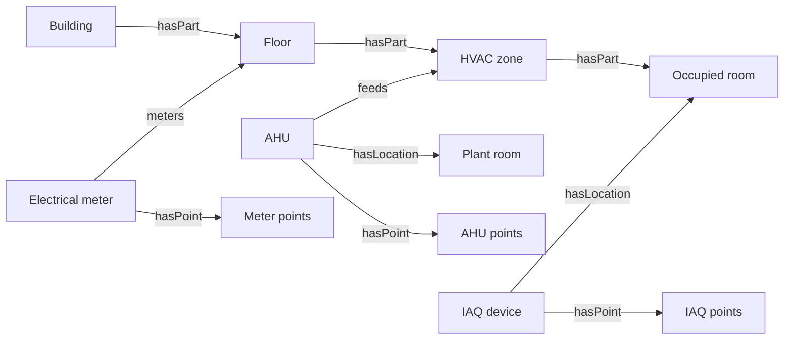
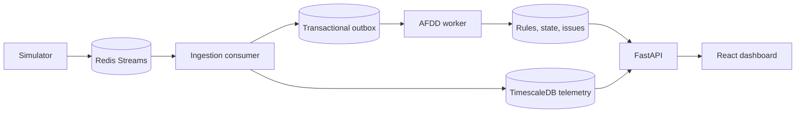

# Understanding checkpoint

## 1. User problem

Property engineers need to turn recurring operating knowledge into monitoring that works across sites without hiding local differences. Technicians need an issue to preserve enough evidence to answer what happened, when it qualified, and which occupied rooms may be affected. Operations managers need to know whether the telemetry and evaluation pipeline is trustworthy before acting on an issue.

## 2. System boundary

The product imports the supplied inventory, streams AHU, IAQ, and electricity readings through Redis, validates and persists them in PostgreSQL with TimescaleDB, evaluates versioned AFDD rules, and exposes the result through FastAPI and a React dashboard. It supports a guarded natural-language-to-rule workflow through bounded server tools. Physical gateways, equipment control, work orders, production identity and authorization, autonomous activation, backtesting, MCP, and production cloud deployment remain outside this assessment.

## 3. Domain interpretation

- An AHU is physically installed in a plant room through `hasLocation`; it serves an HVAC zone through `feeds`. Only the served zone and its contained rooms form the potentially affected scope.
- A zone groups rooms that receive air together. A room remains an independently contained space and may own an IAQ device.
- Equipment owns points through `hasPoint`. The point carries the value type, unit, expected interval, and canonical semantic class used to validate observations.
- Missing or stale input means the evaluator lacks trustworthy evidence and resets a qualifying window. Normal data is a valid, recent observation that explicitly disproves the fault condition.

## 4. Telemetry event

Each event contains `event_id`, `point_id`, `value`, `unit`, `quality`, `device_timestamp`, and `source`. `event_id` is the idempotency key. `point_id` resolves through the ontology registry before persistence. `device_timestamp` controls current-state ordering and AFDD duration; receipt and processing timestamps describe platform behavior. Units and value types must match the point registry, and only accepted quality values participate in evaluation. Live simulation creates a new event identity for each emitted observation while preserving the starter-pack ID and timestamp in source provenance; deterministic replay retains the originals.

## 5. Ontology representation

PostgreSQL stores canonical entities and directed relationships. `hasPart` models containment, `hasLocation` installation, `feeds` direct AHU service, `hasPoint` point ownership, and `meters` measurement scope. API responses enrich these records with Brick 1.4.4 and QUDT URIs while application metadata holds property type, tenant-area flags, source IDs, expected intervals, and display labels. Telemetry rows reference canonical point IDs. New-building onboarding validates a complete register in one transaction before live events are admitted.

## 6. AFDD interpretation

A qualifying window starts on the first recent, good-quality observation where the AHU is ON and the absolute SAT-to-setpoint difference exceeds the effective threshold. Consecutive observations continue it when all required inputs remain trustworthy and the condition stays true. OFF, invalid, absent, stale, or normal input resets the pending window. The issue opens once device time reaches the configured duration and preserves every qualifying observation and its rule version. Normal trustworthy input recovers the issue. A later complete window creates a new recurrence rather than mutating the recovered issue.

## 7. Architecture and risks

The main risks are misleading issues from missing or out-of-order observations, ontology drift that silently changes target sets, and duplicated processing across horizontally scaled workers. The design addresses them with event idempotency and device-time ordering, explicit ontology paths plus previewed exclusions, and database-locked outbox/state transitions. Production rollout still requires partitioning, stronger tenancy controls, and operational alerting described in [Known limitations](limitations.md).

## 8. Assumptions and clarification questions

The implementation assumes a required input becomes stale after twice its expected 60-second interval, an interrupted qualifying window resets rather than pauses, recovery happens on the first trustworthy non-fault observation, and one open issue exists per rule version and equipment. The supplied pack does not state a Brick release, so the mapping pins stable Brick 1.4.4 and exposes that version through the API. A variation that compares one AHU with two room sensors requires the engineer to choose aggregation, freshness, and duration before a draft can pass validation; the system must ask instead of selecting those semantics itself.
